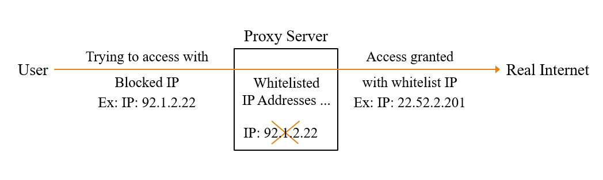

## Proxy Deisgn Pattern
It's structural design pattern. It provides an object as a substitute of another object. To
- Control access
- Enhance performance
- Add functionalities (Security, Logging or Caching)

### When to use?
1. Lazy Initialization– Load a heavy object only when needed.
2. Security – Restrict access to specific users.
3. Logging & Monitoring – Log requests before accessing the real object.
4. Caching – Store frequently used data to improve performance.
5. Remote Proxy – Control access to remote resources.

### Components
- Subject --> Common interface for real and proxy objects.
- Real Subject --> Actual object.
- Proxy --> Controls access to the real subject and adds extra logic.    

